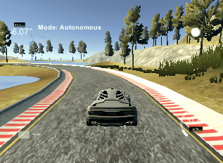

# CarND-Controls-PID
Self-Driving Car Engineer Nanodegree Program

---

## Dependencies
* ubuntu
 	* [Windows](https://www.howtogeek.com/249966/how-to-install-and-use-the-linux-bash-shell-on-windows-10/)
* cmake >= 3.5
 * All OSes: [click here for installation instructions](https://cmake.org/install/)
* make >= 4.1(mac, linux), 3.81(Windows)
* gcc/g++ >= 5.4
* [uWebSocketIO](https://github.com/uWebSockets/uWebSockets)
	```
	git clone https://github.com/uWebSockets/uWebSockets 
	cd uWebSockets
	git checkout e94b6e1
	mkdir build
	cd build
	cmake ..
	make 
	sudo make install
	cd ../..
	sudo ln -s /usr/lib64/libuWS.so /usr/lib/libuWS.so
	sudo rm -r uWebSockets
	```
* [Term 2 Simulator](https://github.com/udacity/self-driving-car-sim/releases)
	* [Windows](https://drive.google.com/open?id=10J4N17bD7BhyW7ESzTaF_IUPveTBCZPn)


## Basic Build Instructions

1. Clone this repo.
2. Make a build directory: `mkdir build && cd build`
3. Compile: `cmake .. && make`
4. Run it: `./pid`. 

<div align=center></div>

